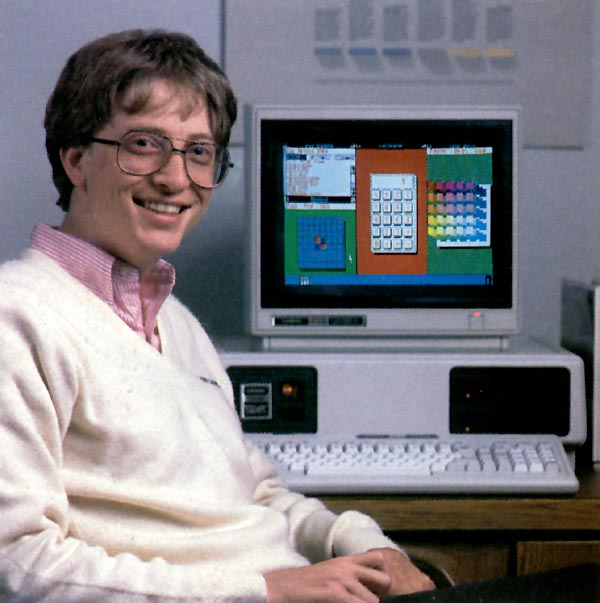

Henry Ford was not only the pioneer in automobile, he was also, according to multiple [credible sources](http://www.compelo.com/henry-ford-net-worth/), the richest person who has ever lived with the net worth of today currency of **$199 billion**. A lot of this success comes from creating assembly lines in his factories. In other words, he standardized every single procedures in how his workers making car.

It worked so well that a single vehicle was completed in **2 hours and 30 minutes**, [instead of **12 hours**](http://www.history.com/this-day-in-history/fords-assembly-line-starts-rolling), and thus making it a lot more affordable for masses. Needless to say, Henry's method of producing goods was quickly adopted and widely used by every factory in the world. It was so big that even the world-renowed actor, Charlie Chaplin, did a [sketch about it](https://www.youtube.com/watch?v=NT-mVVprnbs).

By creating assembly line in manufactoring goods, Henry showed us that there was an optimal, standardized way to maximize the output and achieve the desired result. One may ask: "OK! How is this relavent to programming?" Well! It is very relavent. Let's take the writing style of the English language for example, since we all (coders and non-coders alike) use it. Imagine the amount of miscommunications that the readers may have if the writer just does not use the comma how it is supposed to be used.

If this is the for the English language, we should be even more cautious when it comes to programming languages, where the readibility is very crucial. Prior to understanding and implementing this concept, I was carefree like a bird in the sky, coding however way I wanted. Since I am learning javascript, someday, I feel like being the 'var' guy, while others, I can become the 'let'. It seemed like I was having "multiple coding personality disorder." As the result, whenever I showed my codes to my peers for help, I would see a confusing look on their faces. 

Fortunately, this all changed when I started using ESLint. It forced me to conform to certain way of programming. Honestly, it was painful at first, like a bird in the cage. However, after having more experience with it, I now feel like an eagle soaring in the blue sky, knowing exactly the things I need to get what I wanted. Whatever programming language you are learning, I encourage you to find out what the standardized coding techniques are and follow it. Trust me! It will make you feel like Bill Gate (or whoever your software engineer heros are).

