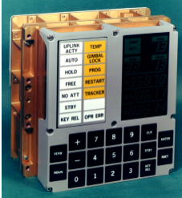
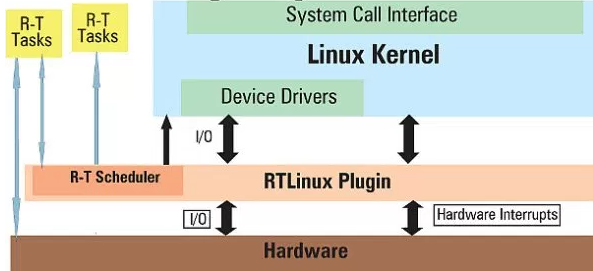

An embedded system is a fixed or programmable combination of computer hardware and software. It is designed with specific functions in mind or used as part of a larger system. It does not have to be as simple as a computing system with no user interface. An embedded system can be complex as a mobile devices, equipped with graphical user interfaces and powerful processors. Therefore, anybody can readily find one anywhere in the world, such as:  automobiles, medical equipments, cameras, household appliances, airplanes, vending machines, toys, etc.[1]. In other words, it is the embedded systems that make the world go around. If all of them were to stop working just for 1 minute, absolute choas and unfathomable destructions are the only words can describe such event. Due to its importance, this essay is dedicated to explore what embedded systems are and how they are are used.

## History

Although the things listed above sounds relatively new to us, the embedded system has been around since the 1960’s. The first one was invented by C. S. Draper at the MIT Instrumentation Laboratory, and its job is to be a flight computer for the Apollo moon landings [2].

The First Embedded System: Apollo Guidance Computer [3]

In 1965, just a few years after, the first commercial computer, PDP-8, was introduced to the world. It was developed by Digital Equipment Corporation and became the world’s best selling computer in 1973 [4]. After such victory, people started to integrate embedded systems into more things, such as automobile (Volkswagen 1600’s) in 1969. Inevidently, it gave birth to many things that people cannot live without, such as: home computer in 1975, the worldwide web and printers in 1989, and 10 million mobile phones in 1992 [5].

## Real Time Operating Systems
It is hard to talk about the history of embedded system without mentioning the important role it plays in creating real time operating systems (RTOS). Besides providing management for hardware resources and hosting applications on computers like any other general-purpose operating system (Windows, Mac OS), RTOS adds a great deal of precision in timing and high degree of reliability. RTOS is extremely essential when errors during computation are costly and even life-threatening. A great example for this is airbag in automobiles. A small error in timing can be very catastrophic for human life. [6]

#### FreeRTOS
One of the most popular RTOS available right now is FreeRTOS. The fact that it is under GPL license (General Public License) allows it to be  obtained and accessed by anyone. Since it is an open source software, it is constantly being sharpened and improved by developers all over the world, which makes the OS very reliable. EETimes, a famous magazine among the global electronics community, rates FreeRTOS among the top choice for embedded systems many consecutive years [8].

#### RTLinux
Another RTOS just as famous as FreeRTOS is RTLinux. People usually confuse this with another software from the Linux Foundation with the name real-time Linux. RTLinux, though, is developed and maintained by Wind River. The architecture of the OS is shown in figure below

The architecture of RTLinux [9]

The three important things to take away from this figure are that: RTLinux places itself between the real hardware and the kernel, it behaves as the hardware for kernel, and processes the kernel as a single big process. All of these structures allow it to give real-time response to all RT tasks whenever they need resources, and all non-RT tasks can be executed by the kernel when the OS is in idle state [9].

#### VxWorks
Another widely-used RTOS developed by Wind Rivers is VxWorks. It is designed to be easily customized and fit to run on many distributed computing processors. It provides a broad range of applications, such as controlling network and communications among different systems, testing and measuring equipment, automotive systems, etc.
The architecture of VxWorks is similar to Unix, which are shell, debugging, memory management, support for multiprocessing.  The main difference is inclusion of kernel for preemptive multitasking [10].

## Other Embedded Operating Systems
#### TinyOS
TinyOS was developed to fill the gaps that other traditional OS could not fulfill, such as efficiency in utilizing energy/power, and small footprint in design usage. The software is written in nesC programming language. Because of the choice of language, TinyOS is used a lot in embedded systems for wireless sensor networks [11].

#### Raspberry Pi
Raspberry Pi was created by Raspberry Pi Foundation in 2015. The main goal for these devices is to provide the world low-cost, reliable computers for everyone to use. Because of its affordability and functionality, this piece of hardware became a top choice for anyone looking to create an embedded system. The recommended OS for Raspberry Pi is Raspbian or Debian-based Linux to be able to get the most out of the device [12].

## Conclusion
As the future is getting more technologically advanced, embedded systems will become more widely used and familiarized to more people all over the world. Because of its inevident future, the sooner one gets to know the system, the better since it will open many doors for inventions that can change people’s lives, and even the whole world. One excellent example is the rapid growth of smart mobile devices. Therefore, I am excited for the next big thing that embedded systems have in store for humanity.

### References:

1. M. Rouse, “What is embedded system? - Definition from WhatIs.com,” IoT Agenda, Dec-2016. [Online]. Available: http://internetofthingsagenda.techtarget.com/definition/embedded-system.
2. J. Pultorak, “NASA Office of Logic Design,” Block I Apollo Guidance Computer (AGC): How to build one in your basement, 03-Feb-2010. [Online]. Available: http://klabs.org/history/build_agc/.
3. “Artifact Details” Computer History Museum. [Online]. Available: http://www.computerhistory.org/collections/catalog/102622655.
4. D. Jones, “What is a PDP-5?,” faqs.org, 27-Mar-2014. [Online]. Available: http://www.faqs.org/faqs/dec-faq/pdp8-models/section-1.html#b.
5. “Embedded In Our Society: A History Of Embedded Operating Systems,” Hughes Systique Corp., 18-Feb-2014. [Online]. Available: https://hsc.com/Blog/Embedded-In-Our-Society-A-History-Of-Embedded-Operating-Systems-1.
6. “What is a Real-Time Operating System (RTOS)?,” What is a Real-Time Operating System (RTOS)? - National Instruments, 22-Nov-2013. [Online]. Available: http://www.ni.com/white-paper/3938/en/.
7. “Intro to Real-Time Linux for Embedded Developers,” The Linux Foundation, 22-Aug-2017. [Online]. Available: https://www.linuxfoundation.org/blog/intro-to-real-time-linux-for-embedded-developers/.
8. “FreeRTOS - Market leading RTOS (Real Time Operating System) for embedded systems with Internet of Things extensions,” FreeRTOS - Market leading RTOS (Real Time Operating System) for embedded systems with Internet of Things extensions. [Online]. Available: http://www.freertos.org/.
9. M. Kumar The author is a freelance developer and trainer. He leads a team in Linux kernel programming, Linux administration, cluster computing, embedded systems and QT/GTK programming on Linux. View and participate in the latest discussions on his Yahoo Group., “Getting Started with RTLinux,” Open Source For You, 28-Jun-2016. [Online]. Available: http://opensourceforu.com/2010/12/getting-started-with-rtlinux/.
10. M. Rouse, “What is VxWorks? - Definition from WhatIs.com,” SearchNetworking, Jun-2007. [Online]. Available: http://searchnetworking.techtarget.com/definition/VxWorks.
11. S. Shodhan Follow, “TinyOS,” LinkedIn SlideShare, 08-Nov-2013. [Online]. Available: https://www.slideshare.net/snecute/tinyos.
12. N. Heath | in European Technology, April 22, 2012, 9:13 PM PST, “10 coolest uses for the Raspberry Pi,” TechRepublic, 22-Apr-2012. [Online]. Available: http://www.techrepublic.com/blog/european-technology/10-coolest-uses-for-the-raspberry-pi/.
