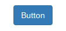

In 2017, my wife and I got a chance to visit Tokyo, Japan. Of all the amazing things we got to experience, one of our favorite things about this city was its train system. We got to travel many parts of Tokyo within in a matter of few days all thanks to its effiency and map design, especially the latter. Why map design played such a crucial role in our trip? Because it was able to bring something as complex as the train system in Tokyo to be so comprehensive that even foreigner can use. Interestingly, the Japanese was not the one that created this design style, it was the Britain, namely, Harry Beck. Prior to him coming with this brilliant design, the London underground map was more like a plate of spaghetti. This is the map in 1926


I think I would definitely need a magnifying glass to be able to identify which name belonged to which station. The more the train system grew, the less readability the map would become. Apparently, I was not the only one thinking this way, because in 1931, Harry Beck drew the map with the design style that later adopted by every railroad system in the world.


Similar to the train system, programming languages are highly complex. People have given up learning how to program for many reasons, one of those is its robotlike syntax. When I first looked at lines of code on the display of my laptop, I was completely lost, and I still am. For people like me, we need a Harry Beck in computer science industry to save us all! Fortunately, there is a programming language in web design that seemed to have been touched by Harry Beck. It is Semantic UI. "How?" you may ask. Let's take a look at a comparasion between Bootstrap, another famous framework for web design, and semantic UI. In order to create a  in bootstap, we need to write the following code:

```
  <button type="button" class="btn btn-primary btn-md">Button</button>    
```

For Semantic UI, we need the following code:

```
<button class="medium ui primary button">Button</button>
```


