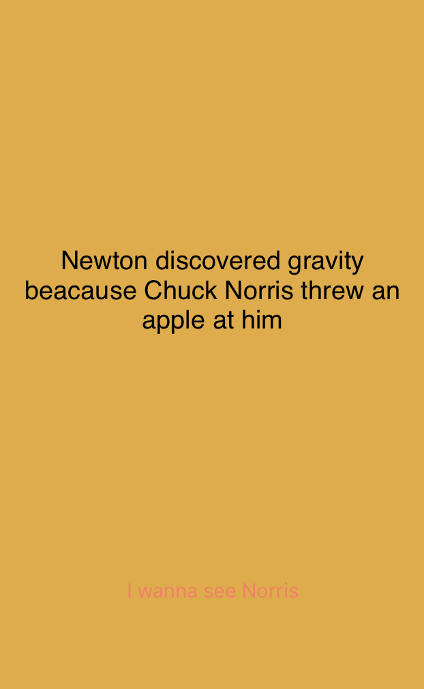
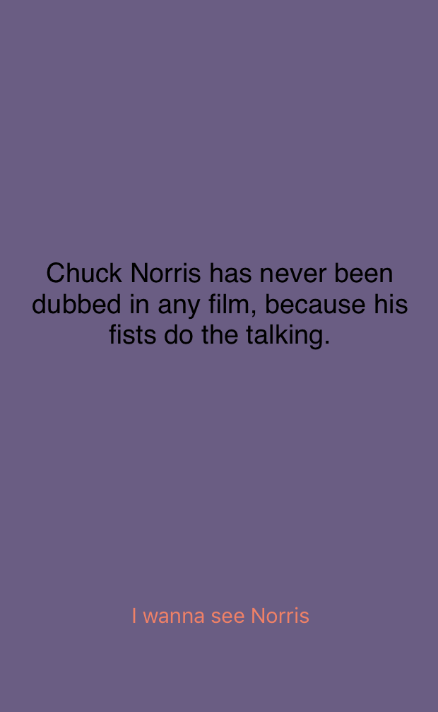

As the world getting more mobile by the use of smart phones, the ability to develop lightweight and fast application becomes extremely crucial. The solution to this dire need lies in develop cloud-based apps, where most of the data are stored in the internet, instead of on the phone, to minimize application size. The data is communicated between the cloud and the phone is usually in API data interaction, which is in JSON or XML format. 

Seeing the importance of learning the necessary skills to integrate API into mobile applications, I started to develop an API-focused app, namely Chuck Norris Jokes. I choose to Chuck Norris jokes because there is an online library of his jokes available in JSON API format. The website can be accessed here: <https://api.chucknorris.io/>

In order to implement API into iOS app, I need to integrate Alamofire into Xcode. Alamofire is an HTTP networking library to empower iOS development with networking capabilites. More information about Alamofire can be access [here](https://github.com/Alamofire/Alamofire).

After completion of integrating Alamofire, I start the process of requesting API from <https://api.chucknorris.io/> by typing the following code:

```swift
    func callAlamo(){
        Alamofire.request("https://api.chucknorris.io/jokes/random").responseJSON(completionHandler: {
            reponse in
            self.parseData(JSONData: reponse.data!)
        })
        
    }
```
Once the source is successfully connect, I can now start parsing the data into the consumable arrays:

```swift
 func parseData (JSONData: Data){
        do{
            var readableJSON = try JSONSerialization.jsonObject(with: JSONData, options: .mutableContainers) as! JSONStandard
            if let quote = readableJSON["value"] as? String{
                self._quote = quote
            }
            
        }
        catch {
            print (error)
        }
    }
```

Having a plain white background is not 'cool' enough for quotes from Chuck Norris, so I decided to add background colors. Everytime a new quote shows up, the color changes. In order to achieve this, I use the following codes:

```swift
struct Color {
    let color = [UIColor(red: 90/255.0, green: 187/255.0, blue: 181/255.0, alpha: 1.0), // teal color
        UIColor(red: 222/255.0, green: 171/255.0, blue: 66/255.0, alpha: 1.0), // yellow color
        UIColor(red: 223/255.0, green: 86/255.0, blue: 94/255.0, alpha: 1.0), // red color
        UIColor(red: 239/255.0, green: 130/255.0, blue: 100/255.0, alpha: 1.0), // orange color
        UIColor(red: 77/255.0, green: 75/255.0, blue: 82/255.0, alpha: 1.0), // dark color
        UIColor(red:105/255.0, green: 94/255.0, blue: 133/255.0, alpha: 1.0), // purple color
        UIColor(red: 85/255.0, green: 176/255.0, blue: 112/255.0, alpha: 1.0), // green color
    ]
    
    func changeColor () -> UIColor{
        let randomNum = GKRandomSource.sharedRandom().nextInt(upperBound: color.count)
        return color[randomNum]
    }
    
} 
```
After further programming for the UI and setting the right configurations in Xcode, the final product is shown in the snapshots below:

<div class="ui big rounded images">
  
  
</div>

You can learn more at <https://github.com/thinhtedlam/ChuckNorriss>


