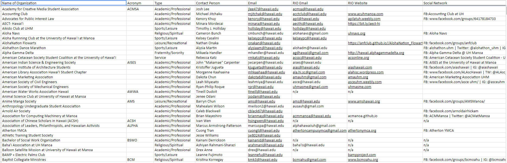
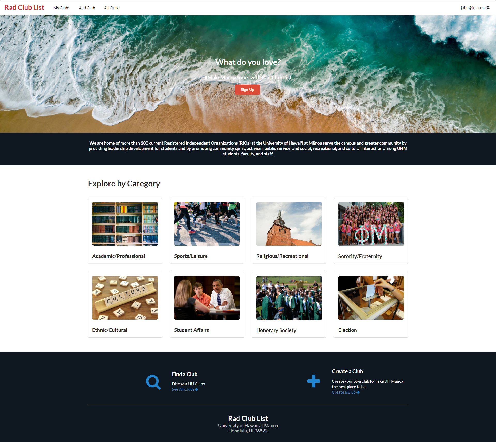
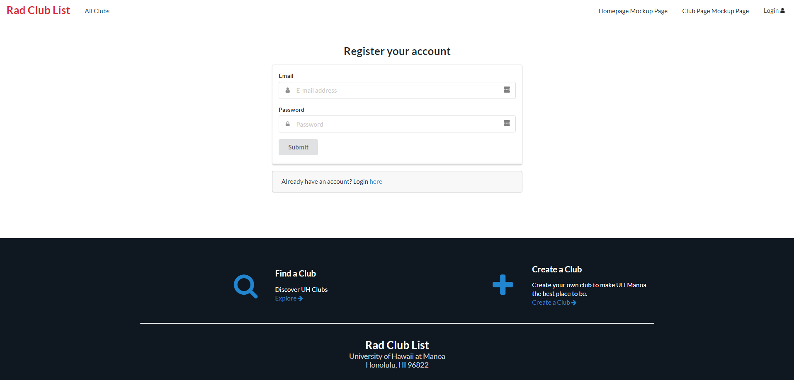
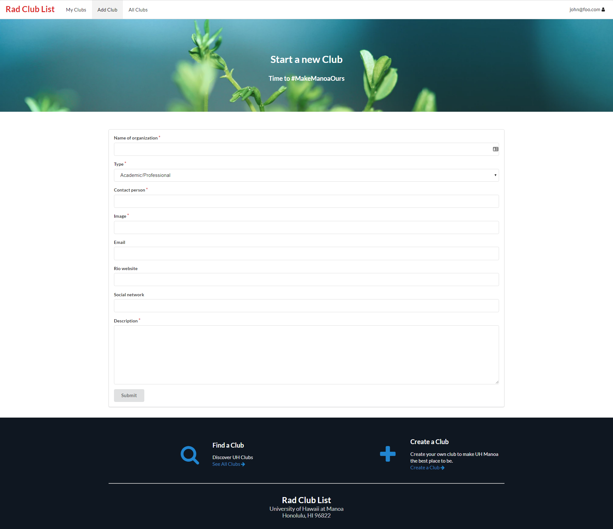

The goal of this application to improve the existing system for students to look for clubs on UH Manoa. As of for now, the only way for students to be informed of the clubs is through a simple spreadsheet. Below is a snapshoot of how the spreadsheet is like:

 

If one was to take a look at the presentation above, he/she can have hard time finding a club that he/she would like to join. On top of that, the user interface is not very appealing at all.

Therefore, my team decided to turn things around. From a simple spreadsheet, we turned it into this:

The user can sign up for a personal account to manage the clubs he/she would like to attend. Not only that, he/she can also start a new club on campus.

My contribution to this project is to design the user interface for it to be appealing and intuitive. Besides designing and building the overall look for the web page, I also format the existing data from UH Manoa to JSON format so it can be implemented into the application.

One of the biggest thing that I learn from this project is the importance of communication among teammates. Without having strong communication, it is very hard to find out where the project is at. Two or more teammates can easily work on the same thing and cause merge conflicts, consequently, waste time and efforts. 

You can access this link to find out more details about our project: <https://rcl808.github.io/>
