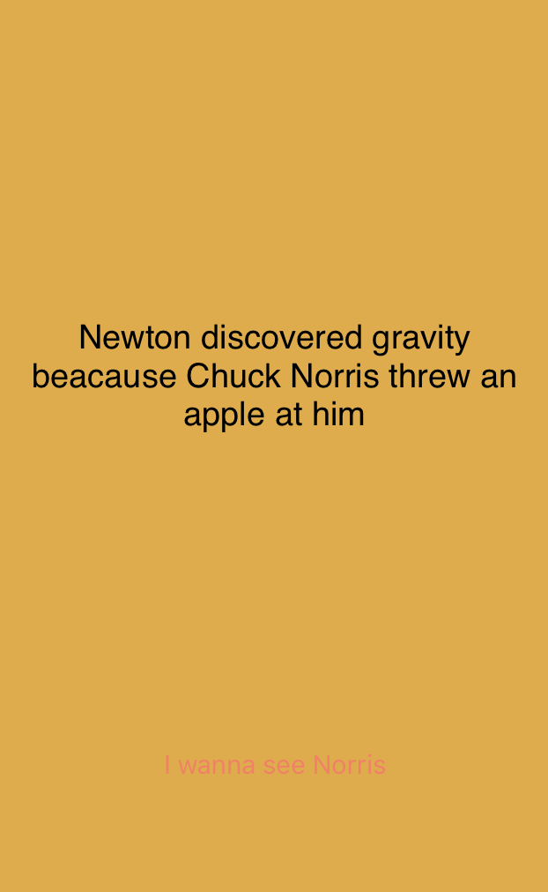
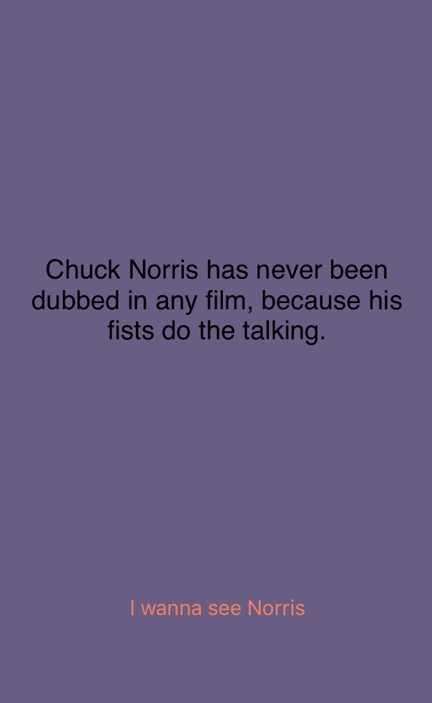

The purpose of this project is to learn how to use Alamofire as a tool to consume API for iPhones apps. Since https://api.chucknorris.io/ has the cleanest api and the easiest to consume, it becomes the best tool to practice.

Here are the snap shoots from the app.

  
  

You can learn more at https://github.com/thinhtedlam/ChuckNorriss

